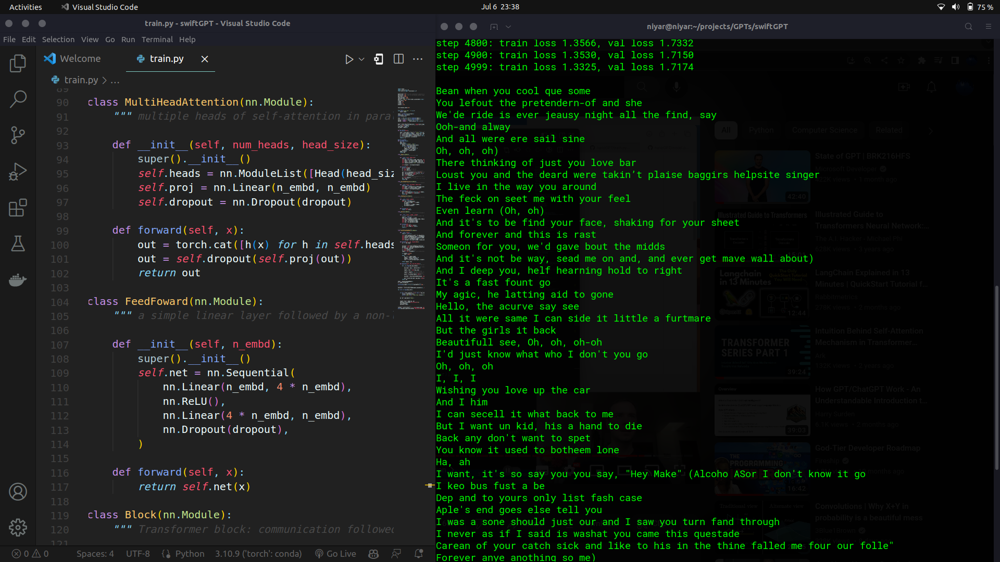

# swiftGPT
SwiftGPT is a simple implementation of the GPT-2 architecture, specifically trained on a dataset containing Taylor Swift songs. This repository serves as a fun and creative way to generate song lyrics that resemble Taylor Swift's writing style. It is a natural language generation model that can be used to produce new song lyrics or simply generate creative text based on the patterns it learned from Taylor Swift's songs.

# output
output after training for 5000 steps
